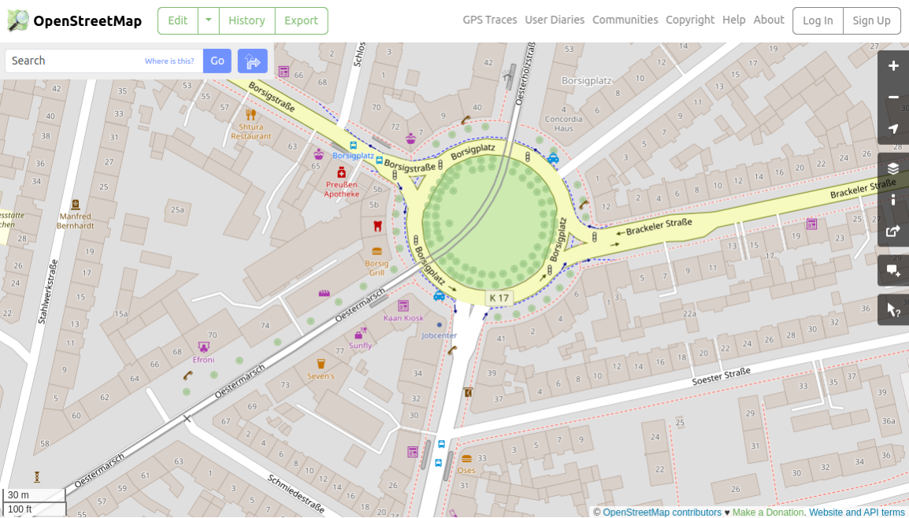
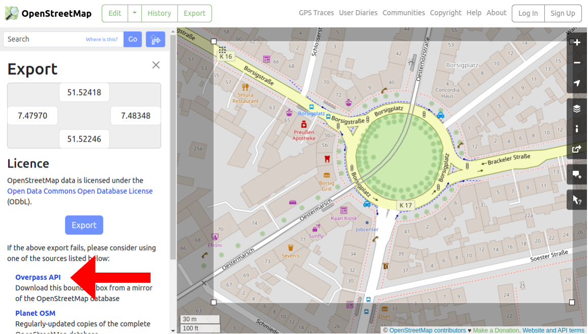
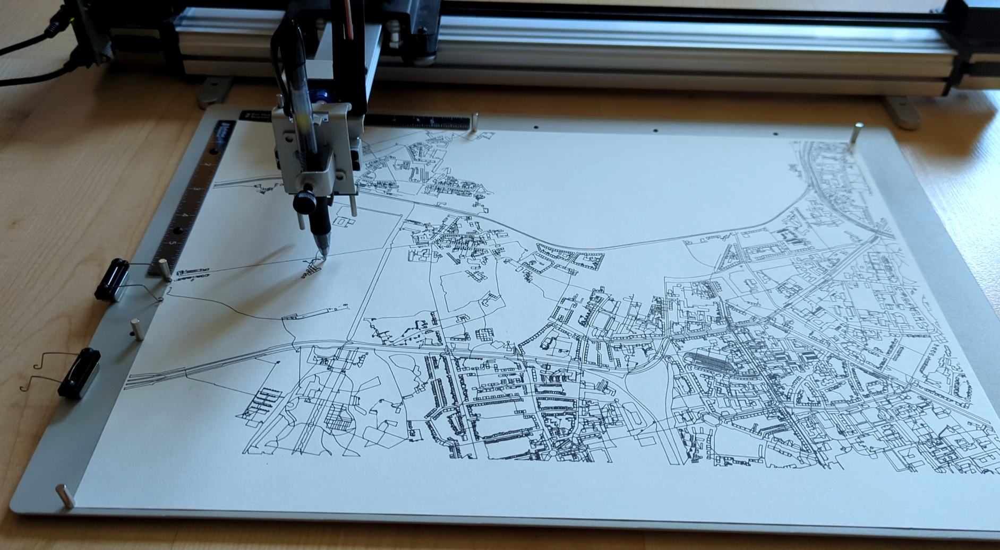

# Plotting Maps

This is a tool to easily create OpenStreetMap SVG maps to plot them with a pen plotter. Check out the tool here: https://piebro.github.io/plotting-maps. There, you can upload OSM exports and render them as SVGs consisting only of lines, making it very pen plotter-friendly.

## How to Use

1. Use a **Desktop Browser** or enable desktop browsing on mobile.
2. Go to https://www.openstreetmap.org.
3. Navigate to a place of interest:
   
4. Click on "Export" (only visible on desktop):
   
5. Select the area of interest:
   
6. Download the data via the Overpass API (you can also use the export button, but the size of the export is more limited):
   
7. Download the file and upload it to https://piebro.github.io/plotting-maps using the "Upload OSM Export" button.
8. Set all options and align the map by dragging and zooming.
9. Download the map using the "Download Map" button.

An alternative way to obtain OSM Map Extracts is to use a [public Overpass API instance](https://wiki.openstreetmap.org/wiki/Overpass_API#Public_Overpass_API_instances) and download an area with a query.

## Plot the Map

I use [vpype](https://github.com/abey79/vpype) and [axicli](https://axidraw.com/doc/cli_api/) to plot the map with my [AxiDraw Pen Plotter](https://shop.evilmadscientist.com/productsmenu/846).

I use linemerge and linesort to make the plotting faster,
```bash
vpype read map.svg \
  linemerge --tolerance 1mm \
  linesort \
  write \
  --page-size 400x266mm \
  --center \
  plot.svg
```

create a preview to check the plotting time,
```bash
axicli plot.svg --model 2 -vg3 --speed_pendown 15 --report_time -o preview.svg
```

and finally, plot the map.
```bash
axicli plot.svg --model 2 --speed_pendown 15 && axicli -m align
```

Plotting a map on an A3 piece of paper.



A similar, cool project with a different UX and output is: https://github.com/anvaka/city-roads/.

## Contributing

Contributions to this project are welcome. Feel free to report bugs, suggest ideas, or create merge requests.

## Developing

The project uses [Prettier](https://prettier.io/playground/) for linting javascript with a `print-width` of 120, `tab-width` of 4, and using single quotes.

## Website Statistics

There is lightweight tracking for the website using Plausible. Anyone interested can view these statistics at https://plausible.io/piebro.github.io%2Fplotting-maps. It's worth noting that these statistics might be an underestimate as many users, including myself, use AdBlockers.

## License

This project is licensed under the MIT License - see the [LICENSE](LICENSE) file for details. The Example map.osm file is licensed under [ODbL](https://www.openstreetmap.org/copyright)